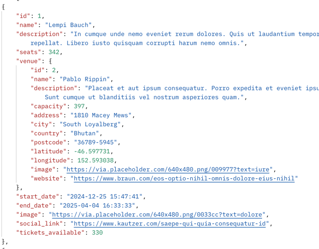
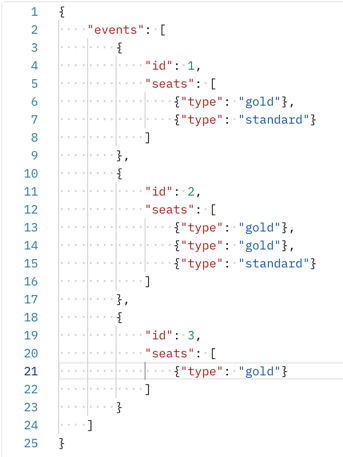
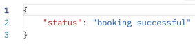
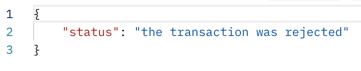
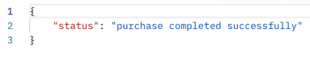
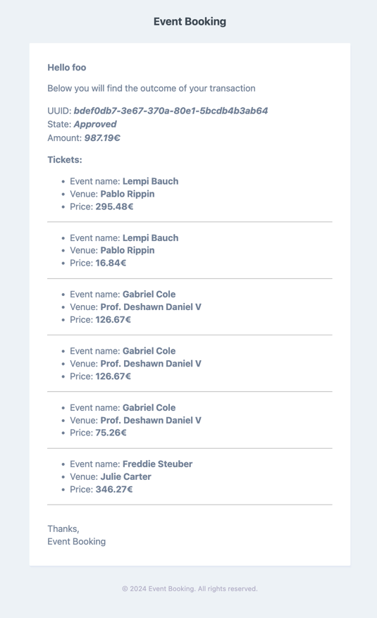
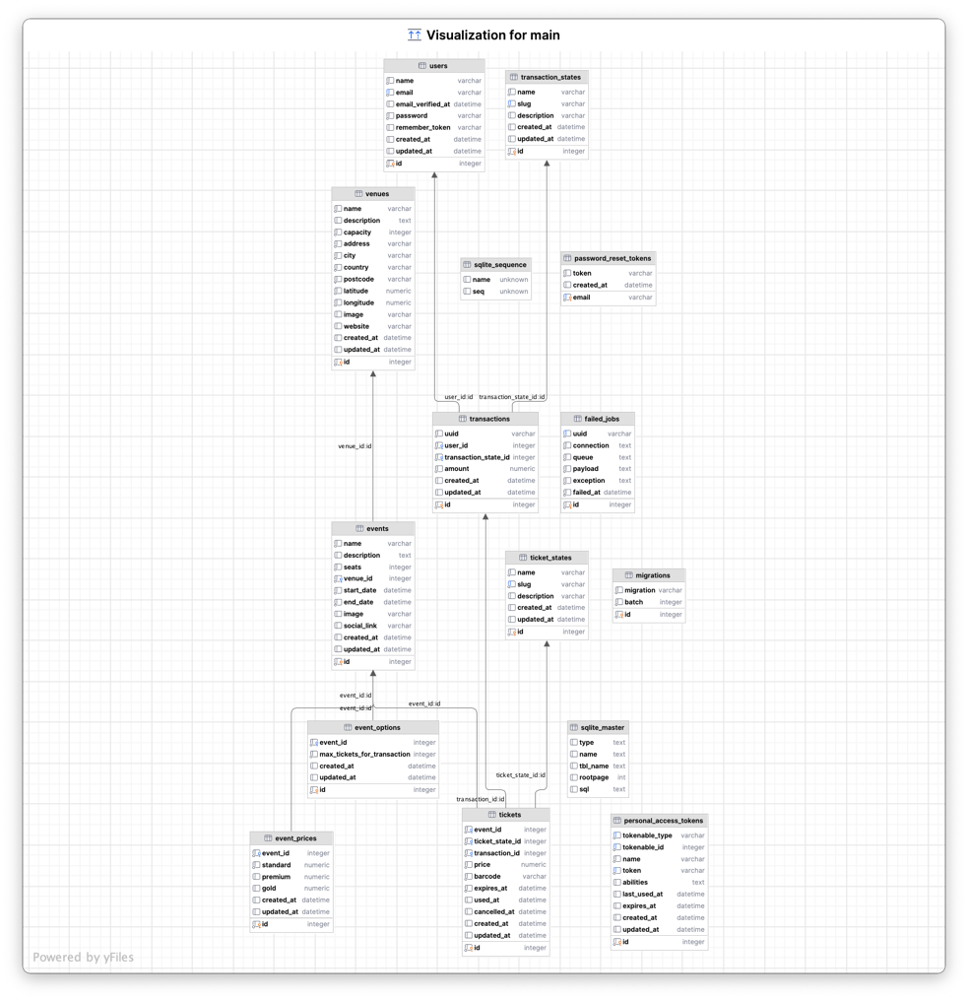

<!-- Improved compatibility of back to top link: See: https://github.com/othneildrew/Best-README-Template/pull/73 -->
<a name="readme-top"></a>
<!--
*** Thanks for checking out the Best-README-Template. If you have a suggestion
*** that would make this better, please fork the repo and create a pull request
*** or simply open an issue with the tag "enhancement".
*** Don't forget to give the project a star!
*** Thanks again! Now go create something AMAZING! :D
-->


<!-- PROJECT SHIELDS -->
<!--
*** I'm using markdown "reference style" links for readability.
*** Reference links are enclosed in brackets [ ] instead of parentheses ( ).
*** See the bottom of this document for the declaration of the reference variables
*** for contributors-url, forks-url, etc. This is an optional, concise syntax you may use.
*** https://www.markdownguide.org/basic-syntax/#reference-style-links
-->
[![Contributors][contributors-shield]][contributors-url]
[![Forks][forks-shield]][forks-url]
[![Stargazers][stars-shield]][stars-url]
[![Issues][issues-shield]][issues-url]
[![MIT License][license-shield]][license-url]
[![LinkedIn][linkedin-shield]][linkedin-url]


<!-- PROJECT LOGO -->
<br />
<div align="center">

[//]: # (  <a href="https://github.com/simonequarticelli/event-booking">)

[//]: # (    )

[//]: # (  </a>)

<h3 align="center">Event Booking</h3>

  <p align="center">
    The Event Booking project is a web application that allows users to browse available events, select an event of interest, choose the number and location of the seats they wish to book, and complete the booking.
    <br />
    <a href="https://github.com/simonequarticelli/event-booking"><strong>Explore the docs »</strong></a>
    <br />
    <br />
    <a href="https://github.com/simonequarticelli/event-booking">View Demo</a>
    ·
    <a href="https://github.com/simonequarticelli/event-booking/issues">Report Bug</a>
    ·
    <a href="https://github.com/simonequarticelli/event-booking/issues">Request Feature</a>
  </p>
</div>


<!-- TABLE OF CONTENTS -->
<details>
  <summary>Table of Contents</summary>
  <ol>
    <li>
      <a href="#about-the-project">About The Project</a>
      <ul>
        <li><a href="#built-with">Built With</a></li>
      </ul>
    </li>
    <li>
      <a href="#getting-started">Getting Started</a>
      <ul>
        <li><a href="#prerequisites">Prerequisites</a></li>
        <li><a href="#installation">Installation</a></li>
      </ul>
    </li>
    <li><a href="#usage">Usage</a></li>
    <li><a href="#roadmap">Roadmap</a></li>
    <li><a href="#contributing">Contributing</a></li>
    <li><a href="#license">License</a></li>
    <li><a href="#contact">Contact</a></li>
  </ol>
</details>


<!-- ABOUT THE PROJECT -->
## About The Project

[![Product Name Screen Shot][product-screenshot]](https://example.com)

### Event Viewing
Users can browse a list of events, sorted by date. For each event, information about the location, date and time, event description, availability and ticket prices are displayed.



__Bonus:__
Each event will have three types of seats type of seat _standard_, _premium_, _gold_. Depending on the type chosen the price will be different.

### Seat Booking
The user can select the types of seats per event and proceed with the booking.<br />
<br />
At the time of the booking request, some checks will be made to validate the request. ex. on the availability of places and the type requested.<br />


### Checkout and Payment
After selecting seats (even on multiple events), the user proceeds to checkout. The app randomly misses a confirmation/decline email to the user with the details of their purchase.<br />
#### Response example
<br />
<br />
#### Email example

### User Account Management
Users can create an account, log in and log out. The user profile maintains a record of the user's past and future bookings.

___

### Additional features
- The reservation was planned with the concept of shopping cart
- There is only one active transaction per user at a time 
- If an active transaction already exists for the user and he executes another request it is powered
- Writing logs in case of error
- Created a FilterableByDatas trait to do statistics on transactions
- When a transaction is rejected, the related booked tickets are cancelled

### Technical concepts
- Events
- Listeners
- Services
- Resources response
- Pagination response
- Computed property on model (ticket_available)
- DB trasaction for data integrity

### TODO

- [ ] Reservation expired
- [ ] Sync shopping cart
- [ ] Discount on events
- [ ] Queue
- [ ] Repository pattern

### API list 
- auth
  - login
  - register
  - logout
  - me
- events
  - list of events with relative availability
- pay
  - checkout and shopping cart pay
- reservation
  - add to shopping cart
- my-reservation
    - show shopping cart

<p align="right">(<a href="#readme-top">back to top</a>)</p>


### Built With
[![Laravel][Laravel.com]][Laravel-url]

<p align="right">(<a href="#readme-top">back to top</a>)</p>


<!-- GETTING STARTED -->
## Getting Started
To get a local copy up and running follow these simple example steps.

### Prerequisites
#### Docker
- __For Mac:__
  - Download Docker Desktop for Mac from the Docker Hub website at 👉 [this link](https://docs.docker.com/desktop/install/mac-install/).
  - Once the Docker.dmg file is downloaded, open it.
  - Drag and drop the Docker app onto the Applications folder in the opened window.
  - Open the Docker app from the Applications folder. You may be asked to provide your system password for the installer to make changes.
  - Wait for the Docker Desktop to notify you that it's ready. It'll appear as a whale icon in your top menu bar.
  
- __For Windows:__
  - Download Docker Desktop for Windows from the Docker Hub website at 👉 [this link](https://docs.docker.com/desktop/install/windows-install/).
  - Once the Docker Desktop Installer.exe is downloaded, run it.
  - In the installation wizard, ensure the "Enable Hyper-V Windows Features" or "Install required Windows components for WSL 2" option is selected and proceed with the installation.
  - When the installation completes, the Docker Desktop application launches automatically.
  - Wait until the Docker Desktop app displays a whale icon in the notification area, indicating that Docker is up and running.


For both Mac and Windows, after installing Docker Desktop, you can verify the installation by opening a terminal window and typing the following command:
    
```sh
docker --version
```

### Installation
1. Clone the repo
   ```sh
   git clone https://github.com/simonequarticelli/event-booking.git
   ```
2. Move into project folder
   ```sh
    cd event-booking
   ```
3. install prerequisites (composer and php)
   ```sh
   ./prerequisites.sh
   ```
4. Run docker container
   ```sh
   docker compose up -d
   ```
5. Create database
   - For convenience I use a sqlite. To set it, modify the following variables by environment like this 
     ```sh
      DB_CONNECTION=sqlite
      #DB_CONNECTION=mysql
      #DB_HOST=mysql
      #DB_PORT=3306
      #DB_DATABASE=event_booking
      #DB_USERNAME=sail
      #DB_PASSWORD=password
      ```
   - And lunch 
      ```sh
      php artisan migrate
      ```
6. Seeding
   ```sh
   php artisan db:seed
   ```
7. To send emails locally, modify the following environment variables. A service that could work well 👉 [link](https://mailtrap.io/) 
   ```sh
    MAIL_MAILER=smtp
    MAIL_HOST=mailpit
    MAIL_PORT=1025
    MAIL_USERNAME=null
    MAIL_PASSWORD=null
    MAIL_ENCRYPTION=null
    MAIL_FROM_ADDRESS="hello@example.com"
    MAIL_FROM_NAME="${APP_NAME}"
   ```
<br />
<br />

If you want to export postman collection 👉 [link](https://github.com/andreaselia/laravel-api-to-postman)
   ```sh
   php artisan export:postman 
   ```


<p align="right">(<a href="#readme-top">back to top</a>)</p>

## Database schema



<!-- USAGE EXAMPLES -->
## Usage

<p align="right">(<a href="#readme-top">back to top</a>)</p>

<!-- ROADMAP -->
## Roadmap

- [x] Data modeling
- [X] Laravel framework
- [X] Laravel Breeze scaffolding
- [X] User Account Management
- [X] Create tables, migrations, factories and seeders
- [X] Relationships between models
- [X] Event Viewing
- [X] Seat Booking
- [X] Checkout and Payment
- [X] Sending email


See the [open issues](https://github.com/simonequarticelli/event-booking/issues) for a full list of proposed features (and known issues).

<p align="right">(<a href="#readme-top">back to top</a>)</p>


<!-- CONTRIBUTING -->
## Contributing

Contributions are what make the open source community such an amazing place to learn, inspire, and create. Any contributions you make are **greatly appreciated**.

If you have a suggestion that would make this better, please fork the repo and create a pull request. You can also simply open an issue with the tag "enhancement".
Don't forget to give the project a star! Thanks again!

1. Fork the Project
2. Create your Feature Branch (`git checkout -b feature/AmazingFeature`)
3. Commit your Changes (`git commit -m 'Add some AmazingFeature'`)
4. Push to the Branch (`git push origin feature/AmazingFeature`)
5. Open a Pull Request

<p align="right">(<a href="#readme-top">back to top</a>)</p>


<!-- LICENSE -->
## License

Distributed under the MIT License. See `LICENSE.txt` for more information.

<p align="right">(<a href="#readme-top">back to top</a>)</p>


<!-- CONTACT -->
## Contact

- __[@linkedin][linkedin-url]__ 
- __[@github](https://github.com/simonequarticelli)__ 
- quarticelli.simone@gmail.com

Project Link: __[https://github.com/simonequarticelli/event-booking](https://github.com/simonequarticelli/event-booking)__


<!-- MARKDOWN LINKS & IMAGES -->
<!-- https://www.markdownguide.org/basic-syntax/#reference-style-links -->
[contributors-shield]: https://img.shields.io/github/contributors/simonequarticelli/event-booking.svg?style=for-the-badge
[contributors-url]: https://github.com/simonequarticelli/event-booking/graphs/contributors
[forks-shield]: https://img.shields.io/github/forks/simonequarticelli/event-booking.svg?style=for-the-badge
[forks-url]: https://github.com/simonequarticelli/event-booking/network/members
[stars-shield]: https://img.shields.io/github/stars/simonequarticelli/event-booking.svg?style=for-the-badge
[stars-url]: https://github.com/simonequarticelli/event-booking/stargazers
[issues-shield]: https://img.shields.io/github/issues/simonequarticelli/event-booking.svg?style=for-the-badge
[issues-url]: https://github.com/simonequarticelli/event-booking/issues
[license-shield]: https://img.shields.io/github/license/simonequarticelli/event-booking.svg?style=for-the-badge
[license-url]: https://github.com/simonequarticelli/event-booking/blob/master/LICENSE.txt
[linkedin-shield]: https://img.shields.io/badge/-LinkedIn-black.svg?style=for-the-badge&logo=linkedin&colorB=555
[linkedin-url]: https://www.linkedin.com/in/simone-quarticelli-1090b7193
[product-screenshot]: images/screenshot.png
[Next.js]: https://img.shields.io/badge/next.js-000000?style=for-the-badge&logo=nextdotjs&logoColor=white
[Next-url]: https://nextjs.org/
[React.js]: https://img.shields.io/badge/React-20232A?style=for-the-badge&logo=react&logoColor=61DAFB
[React-url]: https://reactjs.org/
[Vue.js]: https://img.shields.io/badge/Vue.js-35495E?style=for-the-badge&logo=vuedotjs&logoColor=4FC08D
[Vue-url]: https://vuejs.org/
[Angular.io]: https://img.shields.io/badge/Angular-DD0031?style=for-the-badge&logo=angular&logoColor=white
[Angular-url]: https://angular.io/
[Svelte.dev]: https://img.shields.io/badge/Svelte-4A4A55?style=for-the-badge&logo=svelte&logoColor=FF3E00
[Svelte-url]: https://svelte.dev/
[Laravel.com]: https://img.shields.io/badge/Laravel-FF2D20?style=for-the-badge&logo=laravel&logoColor=white
[Laravel-url]: https://laravel.com
[Bootstrap.com]: https://img.shields.io/badge/Bootstrap-563D7C?style=for-the-badge&logo=bootstrap&logoColor=white
[Bootstrap-url]: https://getbootstrap.com
[JQuery.com]: https://img.shields.io/badge/jQuery-0769AD?style=for-the-badge&logo=jquery&logoColor=white
[JQuery-url]: https://jquery.com 
